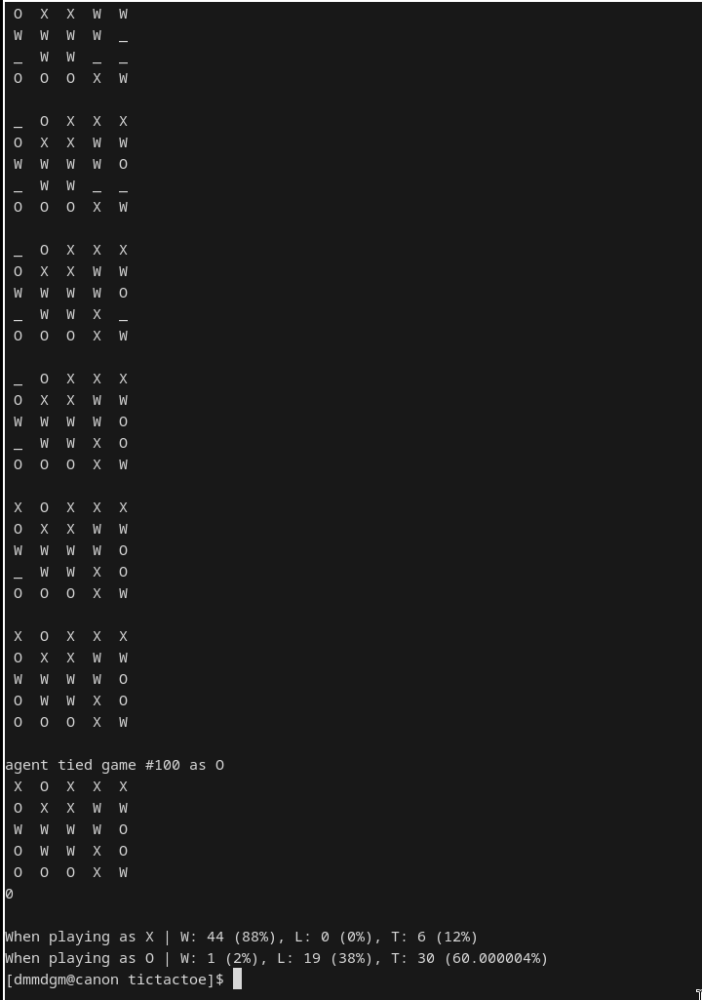

# Engine Behind the Scenes

## Summary

The engine is essentially a massive minimax function. For every available move, play the move, evaluate the position, and undoes the move to try the next one. However, we've also done a lot more in the background to optimize the search and heuristics algorithm as much as possible. All of this took us many many days of exploration and theorization. If you're curious to learn more about what kind of optimizations we've done and tried, feel free to keep reading.

## Transposition Lookup

Imagine the following two positions:

```
[ Move 1 - X's Turn ]
+---+---+---+---+---+
|   |   |   |   |   |
+---+---+---+---+---+
|   |   |   |   |   |
+---+---+---+---+---+
|   |   | X |   |   |
+---+---+---+---+---+
|   |   |   |   |   |
+---+---+---+---+---+
|   |   |   |   |   |
+---+---+---+---+---+

[ Move 2 - O's Turn]
+---+---+---+---+---+
|   |   |   |   |   |
+---+---+---+---+---+
|   |   |   |   |   |
+---+---+---+---+---+
|   |   | X |   |   |
+---+---+---+---+---+
|   |   |   |   |   |
+---+---+---+---+---+
|   |   |   | O |   |
+---+---+---+---+---+

[ Move 3 - X's Turn]
+---+---+---+---+---+
|   |   |   |   |   |
+---+---+---+---+---+
|   |   |   |   |   |
+---+---+---+---+---+
|   | X | X |   |   |
+---+---+---+---+---+
|   |   |   |   |   |
+---+---+---+---+---+
|   |   |   | O |   |
+---+---+---+---+---+
```


```
[ Move 1 - X's Turn ]
+---+---+---+---+---+
|   |   |   |   |   |
+---+---+---+---+---+
|   |   |   |   |   |
+---+---+---+---+---+
|   | x |   |   |   |
+---+---+---+---+---+
|   |   |   |   |   |
+---+---+---+---+---+
|   |   |   |   |   |
+---+---+---+---+---+

[ Move 2 - O's Turn]
+---+---+---+---+---+
|   |   |   |   |   |
+---+---+---+---+---+
|   |   |   |   |   |
+---+---+---+---+---+
|   | x |   |   |   |
+---+---+---+---+---+
|   |   |   |   |   |
+---+---+---+---+---+
|   |   |   | O |   |
+---+---+---+---+---+

[ Move 3 - X's Turn]
+---+---+---+---+---+
|   |   |   |   |   |
+---+---+---+---+---+
|   |   |   |   |   |
+---+---+---+---+---+
|   | X | X |   |   |
+---+---+---+---+---+
|   |   |   |   |   |
+---+---+---+---+---+
|   |   |   | O |   |
+---+---+---+---+---+
```

Notice how, even though X technically begins the game with a different move order, the two board positions are able to reach an identical state by move 3. If we had simply followed through our search algorithm the naive way, the engine would have to re-evaluate the same board position twice. Sure, perhaps it doesn't sound that bad right now. After all, rust is pretty fast, and our computers are even faster. However, the key point is, as we progress further into the game, the number of duplicate positions, called **transpositions**, will only grow exponentially, reaching possibly in the scale of hundreds of thousands by the 5th or 6th move. This is horrible news if we want our engine to navigate anywhere farther than a depth of 3.

This is why we introduced a transposition lookup table in our minimax function. We take a (cheap) screenshot of the current board position and store it into a hashmap alongside with its evaluated score. The next time we reach this position again, we no longer need to do another recursive search. We can just fetch the evaluated score directly from our lookup table and return the heuristics immediate, since identical positions will (or at least they should!) lead to an identical evaluation score. We saw a massive increase in speed thanks to this optimization, although at a cost of higher memory usage. Thankfully, we're not competing on memory usage.

## Alpha Beta Pruning

Alpha beta pruning is a very common strategy in minimax functions. If the evaluated position, even in the best case scenario, is worse than our previously determined move, then there's no point in continuing the search. So, we break out of the search algorithm and skip to the next immediate available option to save time. This, however, came with two big issues:

1. Alpha beta pruner only works if you have a good move guesser, since alpha beta pruning works most effectively if the best moves are found early than later. What's the point of pruning if the best move is found last? There's nothing to prune anymore after that. Thus, we cannot rely on the stencil for generating a vector of available moves. Instead, we wrote a custom move generator that prioritizes empty cells with the most optimal heat maps. See below on the heat map algorithm.

2. Alpha beta pruner rely heavily on an accurate and stable evaluation algorithm. This stumped us for the longest time, since many of our iterations did not have a stable algorithm, meaning the scores change drastically over even a single move. This is not good because the pruner may mistakenly believe that a current move is good or bad right now, but there may be a possibility that the score could worsen or improve significantly just a move or two later, and prune the branch prematurely. See below on our latest approach on set pieces.

## Iterative Search

If we had an infinite amount of time, we could tell the engine to brute force everything. We are guaranteed the best move each time that way. Alas, the world is unfair. We must decide on a maximum depth to search before the timer reaches zero or otherwise we risk accidentally forfeiting the game, which begs the question: what depth should we use for our agent? Too little and we won't be able to find a good move, too much and we run out of time. There's also the problem where it might take a long time in the early game because of the enormous number of possible moves and finishes almost instantly near the end of the game as the number of branches that need to be searched decrease exponentially.

OR... what if we don't need to think about this problem at all?

Iterative search says we can just do a depth of 1 first, then followed by a depth of 2, then a depth of 3, and so on, until we run out of time or reach the end of the board. Wait, how does that work? The essential idea is, we can keep track of the best move we find for each iteration. If we still have time, we do another iteration with a higher depth. If we don't, we always have our answers from the last iteration. This means the algorithm can be flexible depending on the number of searches that it needs to complete. This way, we can always fit under the time limit while also using the maximum depth possible.

You might be wondering, doesn't this sound very wasteful? We're essentially ditching our previous answer each time we begin a new iteration. Wouldn't that be a waste of computation time? Ah, you see, this is where priority searching comes into play.

## Priority Search

There's no reason why we need to ditch our previous answers from the last search completely. After all, even in the event that this move is not most optimal option, it's almost certainly is going to be a good enough move, because otherwise it would not have been chosen in the last iteration. Therefore, if you think about it, this should also mean that our last result is almost certainly still be the best move in the next iteration (which, in most cases, it IS). Therefore, we can let the minimax function first check if the last best move is still good at a higher depth, and then let the alpha beta pruner prune out a lot of early branches to save us a significant amount of time.

Together with all of the previous optimizations, we managed to boost our maximum depth from 4 - 6 to 9 - 10 on an empty board. However, we can do better.

## Heat Map

We still need to sort our available moves to maximum beta prunes. The idea is to count the potential, affinity, and dominance of each empty time for the player.

Potential refers to the number of 3-in-a-rows the player can make if the player had moved in this cell:

```
+---+---+---+---+---+    +---+---+---+---+---+   +---+---+---+---+---+
|   |   | O |   |   |    |   |   |*O*|   |   |   |   |   | O |   |   |
+---+---+---+---+---+    +---+---+---+---+---+   +---+---+---+---+---+
|   | O | ? | X |   |    |   | O |*?*| X |   |   |   | O |*?*| X |   |
+---+---+---+---+---+    +---+---+---+---+---+   +---+---+---+---+---+
| W | O | O | X | X | => | W | O |*O*| X | X | & | W |*O*| O | X | X |
+---+---+---+---+---+    +---+---+---+---+---+   +---+---+---+---+---+
| O | X |   | X |   |    | O | X |   | X |   |   |*O*| X |   | X |   |
+---+---+---+---+---+    +---+---+---+---+---+   +---+---+---+---+---+
| O | X | O | X |   |    | O | X | O | X |   |   | O | X | O | X |   |
+---+---+---+---+---+    +---+---+---+---+---+   +---+---+---+---+---+
```

In this position, O in that question mark cell would have a potential of 2, because it can make a diagonal 3-in-a-row facing bottom left and make a vertical 3-in-a-row with its neighbor.

Affinity refers to the number of similar tiles that are chained linearly to the cell:

```
+---+---+---+---+---+    +---+---+---+---+---+
|   |   | O |   |   |    |   |   |*O*|   |   |
+---+---+---+---+---+    +---+---+---+---+---+
|   | O | ? | X |   |    |   |*O*| ? | X |   |
+---+---+---+---+---+    +---+---+---+---+---+
| W | O | O | X | X | => | W |*O*|*O*| X | X |
+---+---+---+---+---+    +---+---+---+---+---+
| O | X |   | X |   |    |*O*| X |   | X |   |
+---+---+---+---+---+    +---+---+---+---+---+
| O | X | O | X |   |    | O | X | O | X |   |
+---+---+---+---+---+    +---+---+---+---+---+
```

In this position, O in that question mark cell would have an affinity of 5. The bottom left O does not count because it does not "see" the question mark cell in a straight line. The bottom center O also does not count because it is not connected to the question mark cell.

Dominance is similar to affinity except it also counts empty tiles:

```
+---+---+---+---+---+    +---+---+---+---+---+
|   |   | O |   |   |    |   |* *|*O*|* *|   |
+---+---+---+---+---+    +---+---+---+---+---+
|   | O | ? | X |   |    |* *|*O*| ? | X |   |
+---+---+---+---+---+    +---+---+---+---+---+
| W | O | O | X | X | => | W |*O*|*O*| X | X |
+---+---+---+---+---+    +---+---+---+---+---+
| O | X |   | X |   |    |*O*| X |* *| X |   |
+---+---+---+---+---+    +---+---+---+---+---+
| O | X | O | X |   |    | O | X |*O*| X |   |
+---+---+---+---+---+    +---+---+---+---+---+
```

In this position, O in that question mark cell would have a dominance of 10. Dominance may not cross opponent cells or wall cells. The point of dominance is to punish the engine for placing cells too close to enclosed or blocked areas.

Remember, this is not for heuristics (we've tried, it doesn't work). This is for sorting our move order in an attempt to maximize beta prunes.

## Bit Map

Vectors are slow. They are allocated on the heap and are very expensive to clone. If we want to test a position, we have to iterate through all of the cells, which has a time complexity of O(n). Therefore, we use bit maps to encode our positions.

A u32 is the smallest unit that can fit the board. We represent each cell as a bit on the bit map:

```
-> 0b0000000_00000_00000_00000_00000_00000
     \-----/ |----------------+----------|
        |    |                |          |
    (Unused) (Bottom Right)   |          (Top Left)
                              |
             (Each Chunk = Row; Bottom -> Top)
       (Each Digit in Chunk = Column; Right -> Left)
```

A "1" represents the cell is taken; a "0" represents the cell is vacant.

We store three u32's, one for X, one for O, and one for the walls. This way, we can do:

```rs
// Checking if board at index is an X 
if x_bit_map & 1 << index > 0 {
    // ...
}

// Marking an index as O
o_bit_map |= 1 << index;

// Unmarking an index as O
o_bit_map &= !(1 << index);

// Checking if the board is empty (notice O(1) time complexity where normally this is O(n)!)
const TILE_MAP_MASK: u32 = 0b0000000_11111_11111_11111_11111_11111;
let is_empty: bool = !(x_bit_map | o_bit_map | w_bit_map) & TILE_MAP_MASK == 0;

// Unioning multiple bit maps to check custom behaviors
let friendly = match player { Player::X => x_bit_map, Player::O => o_bit_map };
let non_friendly = w_bit_map | match player { Player::X => o_bit_map, Player::O => x_bit_map };
```

All of this means that we don't need to iterate through the entire vector if we need to access, modify, or transform the current position.

It technically doesn't really matter at this scale, but I still think it's neat. Plus, this gives us a very cheap way (O(1) behavior) to take a screenshot of our board.
We can just use a tuple as our key for our transposition tables:

```rs
let transpositions: HashMap<(u32, u32, u32), f32> = HashMap::new();

// (some evaluation code here)

transpositions.insert((x_bit_map, o_bit_map, w_bit_map), eval);
```

## Set Piece

Our final optimization comes from set pieces. Instead of evaluating (1) how close a cell is to the center, (2) how many potential 3-in-a-rows it can make, (3) how strong a cell's potential dominance is, or other numerical calculation methods, which may be mediocre, unstable, or even harmful at times, we instead opted for pattern recognition.

Counter Argument:

(1): Imagine a position like so:

```
+---+---+---+---+---+
|   |   |   |   |   |
+---+---+---+---+---+
|   | W | W | W |   |
+---+---+---+---+---+
|   | W | ? | W |   |
+---+---+---+---+---+
|   |   |   | W |   |
+---+---+---+---+---+
| w | w | W | W |   |
+---+---+---+---+---+
```

Do you think the best move is still near the center? Most likely not. X would be better off getting out of the wall enclosure and find somewhere that has more breathing space, maybe like here:

```
+---+---+---+---+---+
|   |   |   |   | ? |
+---+---+---+---+---+
|   | W | W | W |   |
+---+---+---+---+---+
|   | W |   | W |   |
+---+---+---+---+---+
|   |   |   | W |   |
+---+---+---+---+---+
| W | W | W | W |   |
+---+---+---+---+---+
```

However, if we had simply evaluated from the center, this would have a very low score, so the engine would not have or may have a very difficult time selecting this cell as its final option.

(2): Imagine a position like so:

```
+---+---+---+---+---+    +---+---+---+---+---+
|   |   |   |   | O |    |   |   |   |   | O |
+---+---+---+---+---+    +---+---+---+---+---+
| ? |   |   | O |   |    | ! |   | ! | O |   |
+---+---+---+---+---+    +---+---+---+---+---+
|   | X |   |   |   | => | ! | X | ? | ! |   |
+---+---+---+---+---+    +---+---+---+---+---+
|   |   | X |   |   |    |   |   | X |   |   |
+---+---+---+---+---+    +---+---+---+---+---+
|   |   |   |   |   |    |   |   | ! | ! |   |
+---+---+---+---+---+    +---+---+---+---+---+
```

Do you think the best move is to complete the 3-in-a-row? Maybe... however, a better option would be to block O in the center. The rationale behind this is because:

1. X already has an unavoidable 3-in-a-row. This is not the case for O. X should try to kill O's only option for a 3-in-a-row, because a 1:0 advantage is better than a 1:1 advantage.
2. X can create 2 - 4 more unavoidable 3-in-a-row with the center move. This is way more devastating for O than X creating a quick 3-in-a-row. O can't possibly block all of them before X claims victory. There is no way to easily make our potential algorithm see that advanced move without also creating many many different layers of heuristic calculation (which would also drag down our speed :c)!

(3): Imagine a position like so:

```
+---+---+---+---+---+
|   | W |   |   |   |
+---+---+---+---+---+
|   | X |   |   |   |
+---+---+---+---+---+
|   | X |   | O |   |
+---+---+---+---+---+
|   |   | O |   |   |
+---+---+---+---+---+
| ? |   |   |   |   |
+---+---+---+---+---+
```

If we calculate our heuristics based off of pure dominance, then the bottom left tile would have the highest heuristics for X. Sure, we can correct this by forcing X to prioritize 3-in-a-rows. This was actually our original solution for the day 1 tournament. However, this algorithm neglects similar scenarios in the example above about forks and blockades.

Solution:

We wrote a giant database of good and bad patterns and encouraged the search engine to maximize placements that produces the largest number of good patterns and smallest numbers of bad patterns. This way, the algorithm can learn to create more unstoppable forks and prevent one-move blunders that it couldn't see without a very deep search depth. Additionally, the set piece method fits more intuitively with how humans play tic-tac-toe: We, as humans, don't usually count how many "neighbors" a cell can see when playing this game; we don't instinctively try to always maximize centers or search for cells with the most similar cells around them. No, instead, we like to setup creative traps that simutaneously hinders the opponent's move and masterfully create unstoppable attacks that force the opponent to give us free 3-in-a-rows. This is the purpose of set pieces.

This method has the additional bonus of implementing all of the heuristics above and do it better, because it is now able to know when a specific tactic is good or bad in specific scenarios. It no longer naively add up all of the heuristically with an equal (or malformed) weight; instead, it now has the ability to foresee what the enemy is attempting to do and develop counter measures early to dissolve attacks.

We ran some tests to see how much of an improve these set pieces could make compared to our original tournament solution. **Needless to say, our new engine completely rekt our old solution.**



Out of the 100 games that it played against our old submission, 50 games as X and 50 games as O:

- It lost none of the games as X: This means when its (new vs. old), our old engine couldn't even stand a chance.
- It tied 30 games playing as O: Remember, O's always at a disadvantage in this game. This means, even with our old engine playing as X, which theorically should have better advantage than O, it couldn't even win 60% of the time.
- Surprisingly, our new engine was even able to beat our old solution once playing as O. This is really impressive work considering how defensively O must play to stay alive in this game.

## Anti-Alpha Beta Pruning

Alpha-beta pruning is good, but not always. If our heuristics function is not good enough, it may misjudge a move and prune it prematurely. We took advice from the TA during code review and thresholded it to keep searching if we deemed it totally has enough time to brute force all of the remaining branches. The threshold, through experimental testing, was around 11 remaining moves left. This allowed it to break out of its heuristics trap and find (not just optimal) the best move in that given position.

## Final Words

I think this project is pretty cool. Not only is it competitive, it also forces us to think about algorithms and optimizations, strategies to improve our heuristics, and relations between intertwined and unknown possibilities. Thank you for reading all the way to the end of this documentation.

Let me know if I've made any typos in this documentation. I did not grammar check any of this.

(PS: All code in this project are written by humans (actual organic work, no LLM slop)! We did not and refuse to use any AI in our assignments. c:)
